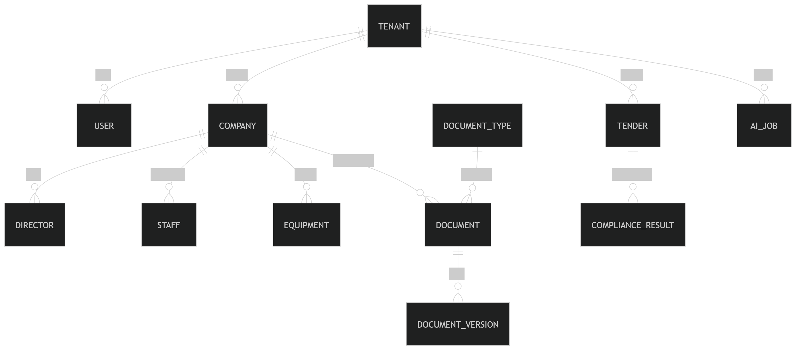

# 🎯 TCDG – Tender Compliance Document Generator

[](https://github.com/your-repo/tcdg)
[](LICENSE)

**Author:** Gershom Maluleke  
**Target Market:** SMEs bidding for government tenders  
**Deployment:** Multi-tenant SaaS  

---

## 1️⃣ Executive Summary

**TCDG** is a cloud-based SaaS platform designed to help SMEs automatically generate government tender compliance documents. Users upload company information once, and the system generates:

- Company profile  
- Safety file  
- BEE affidavit  
- Method statements  
- Full tender compliance packs  

**Key Features:**

- Multi-tenant SaaS architecture  
- AI-powered tender extraction  
- Event-driven asynchronous document processing  
- Document versioning and audit trails  
- Secure, POPIA-compliant storage  

---

## 2️⃣ System Goals

<details>
<summary>Primary Goals</summary>

- Support multi-tenant SaaS with strict data isolation  
- Ensure high availability, reliability, and scalability  
- Support async AI processing for complex tenders  
- Secure sensitive data in compliance with South African regulations  

</details>

<details>
<summary>Non-Goals (Phase 1)</summary>

- Direct tender portal submission  
- Mobile app interface (planned Phase 2)  
- Enterprise-specific isolated databases  

</details>

---

## 3️⃣ Technology Stack

| Layer               | Technology                     | Purpose                                         |
|--------------------|--------------------------------|------------------------------------------------|
| **Frontend**        | React / Next.js                | Responsive web interface                       |
|                    | TailwindCSS                    | Styling & components                           |
|                    | React PDF Viewer               | Document previews                              |
| **API Gateway**     | Spring Cloud Gateway / Nginx   | Routing & rate-limiting                        |
| **Auth**            | Spring Security + JWT          | Role-based access control, tenant isolation    |
| **Core API**        | Spring Boot (Java 17+)        | Business logic & entity management             |
| **Document Service**| Thymeleaf / Freemarker        | Template rendering                             |
|                    | OpenPDF / iText                | PDF generation                                 |
|                    | DOCX4J                         | DOCX document generation                       |
| **AI Service**      | OpenAI API / Local LLM         | Tender extraction & method statements         |
|                    | Kafka / Spring Boot Async      | Async event-driven processing                  |
| **Compliance Engine**| Spring Boot Module           | Checks company vs tender compliance            |
| **Database**        | PostgreSQL                     | Multi-tenant relational storage                |
|                    | Read replicas                  | Read scalability                               |
| **Cache**           | Redis                          | Caching, rate-limiting, distributed locks     |
| **Object Storage**  | AWS S3 / MinIO                 | Generated document storage                     |
| **Monitoring**      | ELK Stack                      | Logs & audit trails                             |
|                    | Prometheus + Grafana           | Metrics & alerting                              |
|                    | OpenTelemetry                  | Distributed tracing                             |
| **Deployment**      | Docker + Kubernetes            | Container orchestration & scaling              |
| **CI/CD**           | GitHub Actions / Jenkins       | Automated builds & deployments                 |
| **Security**        | TLS 1.2+, AES-256, RBAC       | Secure data & access                            |

---

## 4️⃣ Project Structure (Spring Boot)

```text
tcdg-backend/
│
├─ src/main/java/com/tcdg/
│   ├─ TcdgApplication.java
│   ├─ config/          # Security, Kafka, Swagger, Web
│   ├─ common/          # Exceptions, utils, constants, DTOs
│   ├─ auth/            # Auth controllers, services, entities, repos
│   ├─ company/         # Company CRUD, directors, staff, equipment
│   ├─ document/        # Document generation, versioning
│   ├─ ai/              # Tender extraction & method statement async processing
│   ├─ compliance/      # Compliance engine
│   ├─ billing/         # Subscriptions & usage tracking
│   └─ messaging/       # Kafka producers & consumers
│
├─ src/main/resources/
│   ├─ application.yml
│   ├─ templates/       # Thymeleaf / Freemarker
│   └─ db/migration/    # Flyway / Liquibase
└─ pom.xml / build.gradle


5️⃣ Entity Relationship Diagram (ERD)

## 📊 TCDG Database ERD



Notes:

- Tenant: Multi-tenant separation

- DocumentVersion: Versioning and audit trails

- AIJob: Tracks async processing of tender extraction

- ComplianceResult: Scoring and missing items


6️⃣ Microservice APIs


<details> <summary>Auth Service</summary>
Endpoint	Method	Request	Response	Description
/auth/register	POST	{ "username","email","password","tenant_name" }	{ "user_id","token" }	Register user & tenant
/auth/login	POST	{ "username","password" }	{ "token","refresh_token" }	Login & issue JWT
/auth/refresh	POST	{ "refresh_token" }	{ "token","refresh_token" }	Refresh JWT
/auth/logout	POST	{}	{ "message" }	Invalidate JWT
</details> <details> <summary>Company Service</summary>
Endpoint	Method	Request	Response	Description
/companies	POST	{ "name","registration_number","bee_level" }	{ "company_id" }	Create company
/companies	GET	?page=&size=	[company]	List companies
/companies/{id}	GET	N/A	company	Get details
/companies/{id}	PUT	{ "name","bee_level" }	company	Update company
/companies/{id}	DELETE	N/A	{ "message" }	Delete company
/companies/{id}/directors	POST	{ "full_name","id_number","ownership_pct" }	{ "director_id" }	Add director
/companies/{id}/staff	POST	{ "full_name","role","qualification" }	{ "staff_id" }	Add staff
/companies/{id}/equipment	POST	{ "name","type","certification" }	{ "equipment_id" }	Add equipment
</details> <details> <summary>Document Service</summary>
Endpoint	Method	Request	Response	Description
/documents/generate	POST	{ "company_id","type" }	{ "document_id","status" }	Generate document (PDF/DOCX)
/documents/{id}	GET	N/A	File	Download document
/documents/{id}/status	GET	N/A	{ "status" }	Check generation status
/documents/{id}/versions	GET	N/A	[version]	List versions
/documents/{id}/versions/{vid}	GET	N/A	File	Download specific version
</details> <details> <summary>AI Service</summary>
Endpoint	Method	Request	Response	Description
/ai/extract	POST	{ "tender_id","company_id" }	{ "job_id","status" }	Extract requirements, generate method statements
/ai/job/{job_id}	GET	N/A	{ "status","result_path" }	Check AI job status
/ai/job/{job_id}/download	GET	N/A	File	Download AI-generated document
</details> <details> <summary>Compliance Service</summary>
Endpoint	Method	Request	Response	Description
/compliance/check	POST	{ "tender_id","company_id" }	{ "compliance_id","status" }	Run compliance check
/compliance/{id}	GET	N/A	{ "status","score","missing_items" }	Get compliance results
/compliance/{id}/download	GET	N/A	File	Download PDF report
</details> <details> <summary>Billing Service</summary>
Endpoint	Method	Request	Response	Description
/billing/subscription	POST	{ "plan_type" }	{ "subscription_id" }	Create subscription
/billing/subscription	GET	N/A	[subscription]	List subscriptions
/billing/usage	GET	N/A	[{document_type, credits_used}]	Track usage
</details> <details> <summary>Admin Service</summary>
Endpoint	Method	Request	Response	Description
/admin/tenants	GET	N/A	[tenant]	List all tenants
/admin/users	GET	N/A	[user]	List all users
/admin/logs	GET	?start=&end=	[audit_log]	View system audit logs
</details>


7️⃣ Architecture Diagram


8️⃣ Scalability & Reliability

- Stateless services → Horizontal scaling via Kubernetes

- Kafka → Async event-driven processing for documents & AI jobs

- Redis → Caching, distributed locks, rate-limiting

- PostgreSQL + read replicas → Read scalability

- S3 → Versioned document storage

- Retry & circuit breaker patterns → Fault tolerance

9️⃣ Security & Compliance

- TLS 1.2+ for all traffic

- AES-256 encryption at rest

- Field-level encryption for sensitive data

- RBAC + tenant-scoped JWT

- Audit logging for all sensitive operations

- POPIA compliance

🔟 Future Enhancements

- Direct integration with eTenders Portal

- Mobile application (React Native)

- Enterprise isolated DB per tenant

- AI-powered compliance scoring & recommendations
